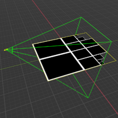

# onX Demo

The task at hand was to create a tile viewer using 3D technologies. The main  requirements like LOD, Frustum Culling and QuadTrees are all things I have no experience or much knowledge in. So gave myself 4 days to learn as much as I can in these topics while try to prototype each step along the way. Sadly I was not fully successful with the end goals laid out in the document, but was able to create many of the pieces in getting there.

# How to view examples
- Best viewed on a Chrome Browser.
- For convience sake, i posted the examples to my personal website to make it easier to quickly view them without any setup.
- If you want to run these samples locally, you would need a webserver to make it work. Since I'm using ES JS Modules, the browser will not allow those to run off the harddrive because of security concerns. An easy option is a chrome extension that allows you to run a local webserver on your computer for development. Its super easy to get started with it: https://chrome.google.com/webstore/detail/web-server-for-chrome/ofhbbkphhbklhfoeikjpcbhemlocgigb?hl=en

# Examples

 

[000_qt_imp.html](http://fungi.sketchpunk.com/temp/onx_demo/000_qt_imp.html)

At this point I worked on trying to implement the QuadTree data structure while using HTML canvas and Javascript to render the results.

I also experimented with "Binary Addressing" of the nodes, but the first node ends up having the same value as its parent because there was no depth associated with the address. Didn't want to waste to much time on it, but was thinking about using the new "BigInt" type in JS to make this work. Reserve the first 6 bits to store the Depth of a node. Ignore the last two bits because its a signed integer. This leaves enough bits to address up to 28 levels in a quadtree, where the requirement mentions that things should be able to reach 20 levels. With just 32 bit signed ints I can only get up to 12 levels if saving depth into the address.
 

~ ~ ~ ~ ~ ~ ~ ~ ~ ~ ~ ~ ~ ~ ~ ~ ~ ~ ~ ~ ~

 

[001_2D_qt_frustum.html](http://fungi.sketchpunk.com/temp/onx_demo/001_2D_qt_frustum.html)

At this stage I started to work on learning how to define frustums and how to use them. Most of the information about this topic is only in 3d but it wasn't to hard to do things in a lesser dimension. I created the frustum without viewing any source code, so How I computed the 4 points ended up being needlessly more complicated. I learned my mistake once I saw how a 3D one is computed, but It was fun to play with ray to plane intersections, regardless.

In the end I was able to create a camera that can be moved and spun around as it tries to create deeper quadtree nodes closer to the camera with larger ones beyond the radius at runtime.

I really like this one, i can play with this for awhile.
 

~ ~ ~ ~ ~ ~ ~ ~ ~ ~ ~ ~ ~ ~ ~ ~ ~ ~ ~ ~ ~

 

[002_3D_qt_frustum_rendering.html](http://fungi.sketchpunk.com/temp/onx_demo/002_3D_qt_frustum_rendering.html)

With some confidence and know how, it was time to move things to 3D. At this stage I looked through some source code of how frustums are rendered in 3D plus created a shader using GLSL to render quads with borders. At this point I had to do some engine improvements to fungi to be able to render quadtrees at runtimes after the init step.

This is where I also start putting together a way to control the frustum by using the keyboard.
 

~ ~ ~ ~ ~ ~ ~ ~ ~ ~ ~ ~ ~ ~ ~ ~ ~ ~ ~ ~ ~

 

[003_3D_qt_frustum_culling.html](http://fungi.sketchpunk.com/temp/onx_demo/003_3D_qt_frustum_culling.html)

At this step I tried to recreate what I had in 2D. Was able to get Frustum culling working to only render the nodes that have at least 1 corner inside the frustrum.

I had some difficulties trying to get this working similarly to the 2D version, but was not successful. Began to believe that I was trying to tackling to many different things at once, so I stopped working on this example to evaluate what my next steps should be.
 

~ ~ ~ ~ ~ ~ ~ ~ ~ ~ ~ ~ ~ ~ ~ ~ ~ ~ ~ ~ ~

 

[004_3D_qt_distance.html](http://fungi.sketchpunk.com/temp/onx_demo/004_3D_qt_distance.html)

By this point, I felt that I should stop working with frustums and only focus on quadtrees and how to better use them. Watched a few video tutorials related to how game developers use Quadtrees to render LOD Terrains.

Using some new insight on the problem, I put together an example of a character walking around a square world.

The idea is quite simple, test the distance between the character and the center of each quad, if its below a threshold then sub divide that area till you reach your max depth level.
 

# Fungi
In this task I used my personal 3D rendering engine that I have built from scratch using WebGL 2.0 and Javascript ES6+. In the course of the task I had to do some engine improvements, like being able to create new entities at runtime. Up till now, all entities were created on init and any new entities created after the fact would not end up being rendering. Also added several new functions to the math lib, mainly Vec2 and Vec3. Plus I created a simple shader to render a quad mesh with a border around it for the purpose of rendering a quadtree in 3d. Also included some new visual debugging features.

# In Closing
This was a difficult but fun exercise. I spend most of my time soley focused on animation and human simulation type of work in 3D. This pushed me out of my comfort zone but it was something I did want to learn down the line in relation to procedural terrain / world generation once I was able to fully control character animations.

Even if am not chosen for this position, thank you for this experience. I know that in the end I came out of this learning lots of new topics, built some fun prototypes to show off which can become future tutorials I can make. I'm always happy to learn something new and add new tools to my toolbox.

Thanks again.